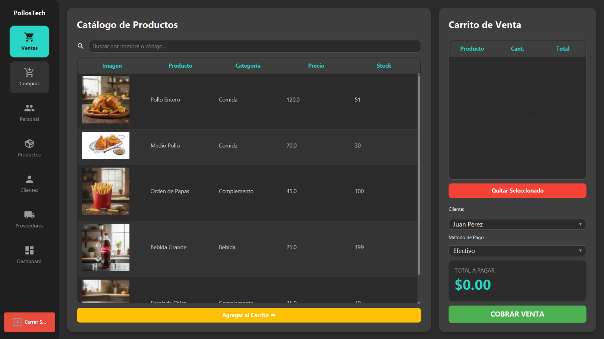
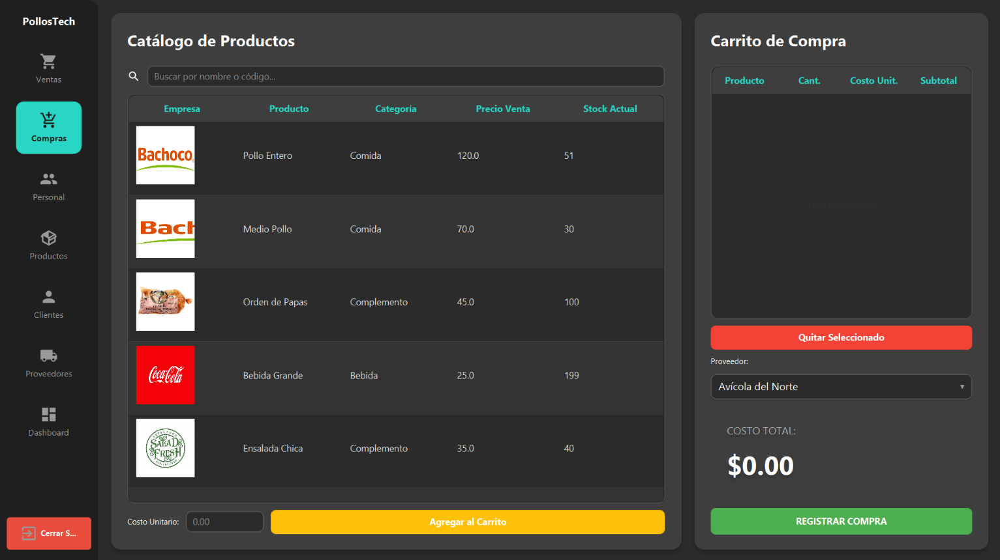
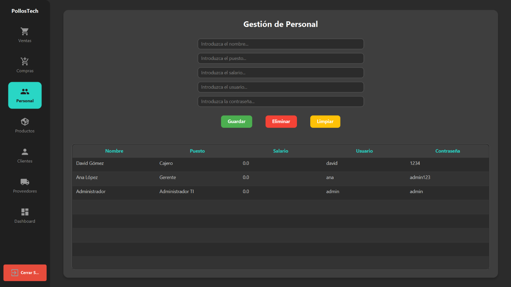
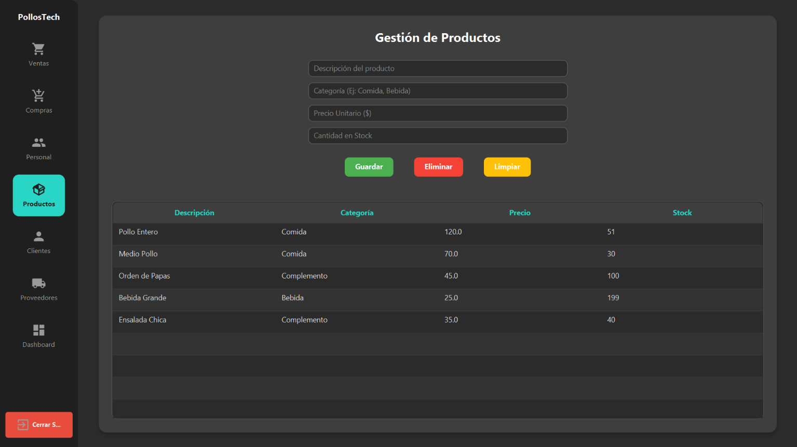
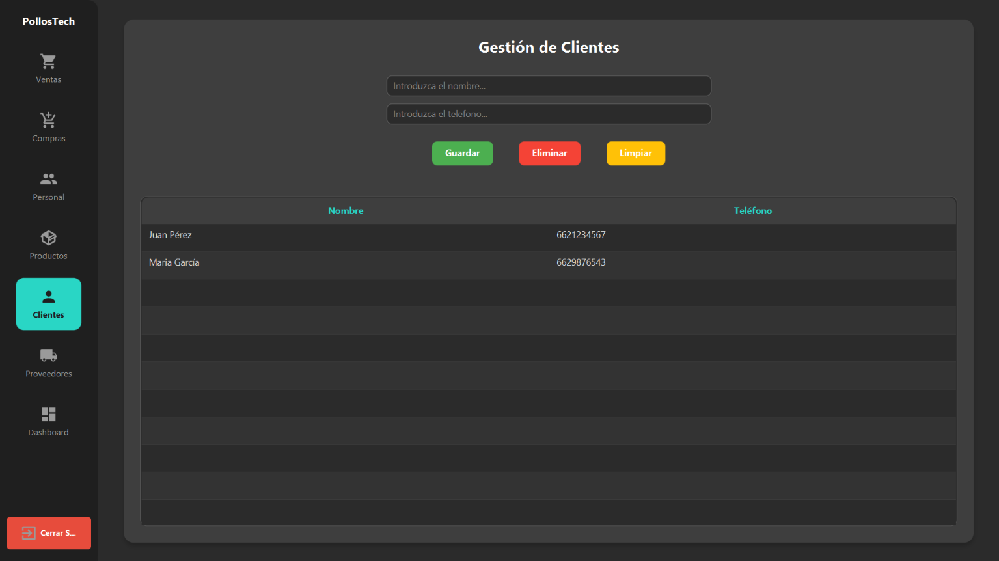
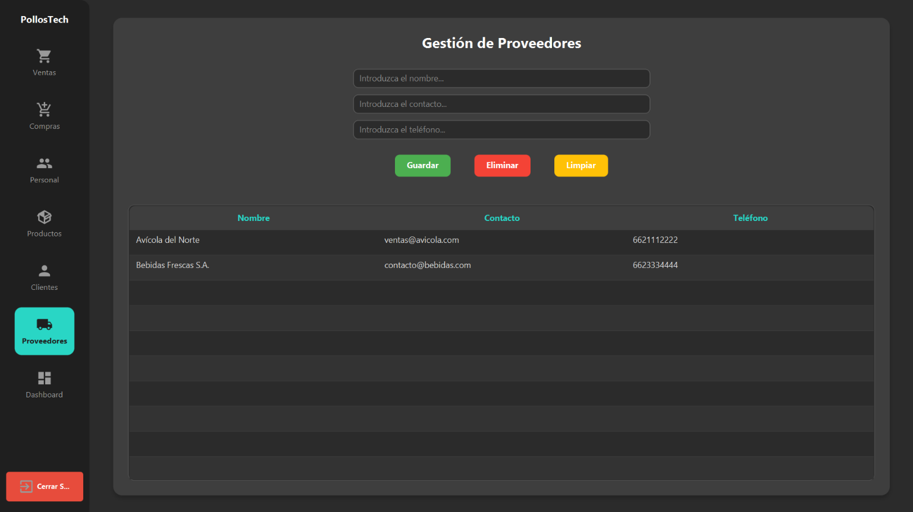
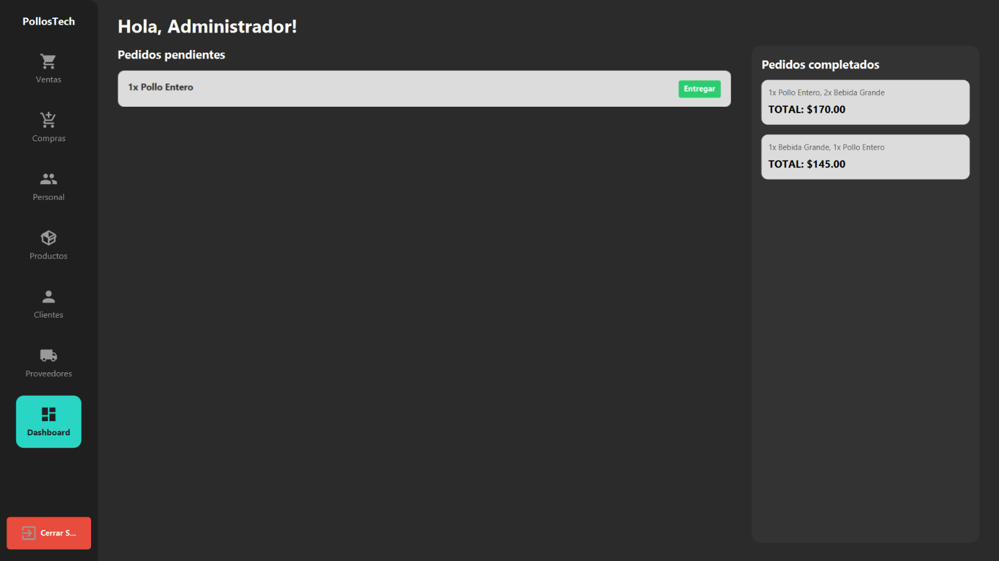

# PollosTech: Sistema de Punto de Venta (POS)

Aplicación de escritorio para administrar un negocio de pollos. Permite iniciar sesión como empleado, gestionar personal, productos, clientes y proveedores, registrar ventas y compras (que actualizan el inventario automáticamente) y dar seguimiento a los pedidos desde un dashboard.



## Características

- **Inicio de sesión** de empleados, con sesión activa durante el uso de la aplicación.
- **Ventas (POS):** catálogo de productos con búsqueda, carrito, selección de cliente y método de pago. Al cobrar, se registra el pedido y se descuenta el stock.
- **Compras:** registro de compras a proveedores con costo unitario. Al registrarlas, se incrementa el stock.
- **Personal:** alta, edición y baja de empleados (nombre, puesto, salario, usuario y contraseña de acceso al sistema).
- **Productos, clientes y proveedores:** gestión completa (CRUD) de cada catálogo.
- **Dashboard:** pedidos pendientes (estatus *Pagado*) que se marcan como *Entregado*, y lista de pedidos completados.
- **Integridad del inventario:** ventas y compras se guardan con transacciones (`commit` / `rollback`), así que una operación se guarda completa o no se guarda.

## Tecnologías

| Área | Tecnología |
|---|---|
| Lenguaje | Java |
| Interfaz | JavaFX (FXML + CSS) |
| Iconos | Ikonli (Material Design) |
| Base de datos | PostgreSQL |
| Acceso a datos | JDBC con `PreparedStatement` y `CallableStatement` |
| Lógica en BD | Procedimientos y funciones almacenados |

## Arquitectura

El proyecto está organizado por capas:

```
src/main/
├── java/com/example/crudjavafx/
│   ├── controller/   # Lógica de cada pantalla (Login, POS, Compras, CRUDs, Dashboard)
│   ├── db/           # Acceso a datos: un "Manejador" por entidad
│   ├── model/        # Clases del dominio (Cliente, Producto, Pedido, Empleado, Session...)
│   ├── LoginApplication.java   # Punto de entrada de JavaFX
│   └── Launcher.java
└── resources/
    ├── com/example/crudjavafx/ # Vistas .fxml, hoja de estilos (dashboard.css) y logos
    └── imagenes/               # Imágenes de productos y proveedores
```

## Base de datos

La aplicación se conecta a una base de datos PostgreSQL llamada `PollosTech` en `localhost:5432`.

**Tablas que usa el sistema:** `Empleado`, `Cliente`, `Proveedor`, `Producto`, `Pedido`, `Detalle_Pedido`, `Compra`, `Detalle_Compra`.

**Procedimientos y funciones almacenados** (16 en total):
- Clientes: `obtener_clientes`, `insertar_cliente`, `actualizar_cliente`, `eliminar_cliente`
- Empleados: `obtiene_empleados`, `insertar_empleado`, `actualizar_empleado`, `eliminar_empleado`
- Productos: `obtener_productos`, `insertar_producto`, `actualizar_producto`, `eliminar_producto`
- Proveedores: `obtener_proveedores`, `insertar_proveedor`, `actualizar_proveedor`, `eliminar_proveedor`

**Script SQL:** `database_structure.sql` es el único que se ejecuta manualmente (en PgAdmin). Crea las tablas, relaciones y restricciones, y carga datos de ejemplo. Los procedimientos y funciones almacenados los crea la aplicación automáticamente al iniciar.

## Requisitos

- JDK 17 o superior
- PostgreSQL (instalado o en un contenedor Docker)

JavaFX viene incluido en el `.jar` de la versión publicada, así que no necesitas instalarlo aparte.

## Instalación y ejecución

### Inicializar el programa

0. En el caso de descargar el código, se requiere cambiar las credenciales para acceder a la BD en el `LoginController.java`.
1. Ejecutar el `.jar` o el `Launcher.java`; esto creará la base de datos `PollosTech` si no existe.
2. Copiar y ejecutar el `database_structure.sql` en la BD de `PollosTech` en PgAdmin para crear las tablas, relaciones y restricciones.
3. Iniciar sesión en el programa con las credenciales de Admin:
   - **Usuario:** `admin`
   - **Contraseña:** `admin`
4. Para cerrar sesión, presionar el botón rojo de la izquierda inferior; esto regresará al Login.

## Capturas de pantalla

### Ventas (POS)


### Compras


### Personal


### Productos


### Clientes


### Proveedores


### Dashboard


## Contexto

Proyecto desarrollado en equipo en la Universidad de Sonora. Originalmente fue un proyecto de la materia de bases de datos y después se usó como plantilla para el proyecto final de Desarrollo de Sistemas III.

**Equipo:** Sebastián Ibarra Padilla, *(agregar a tus compañeros)*

**Mi participación:** *(describe aquí qué parte hiciste)*

## Autor

**Sebastián Ibarra Padilla** · [GitHub](https://github.com/TU-USUARIO)
